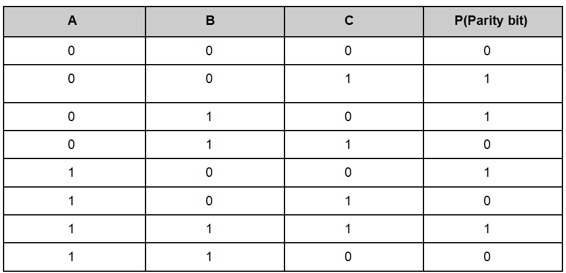
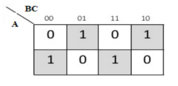
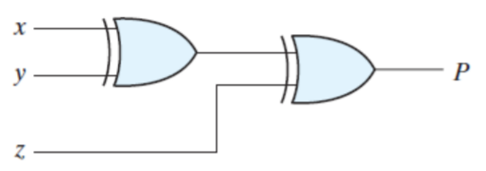
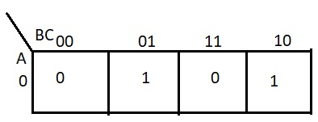

### INTRODUCTION 
<u>
<b>Introduction</b> 
</u>
    
A Parity Generator is a combinational logic circuit that generates the parity bit in the transmitter. A parity generator adds an extra bit to the signal that is being transmitted, so the errors can be recognized and rectified by the machine to some extent.

    
 Parity generators are classified into two types:    i)Even Parity Generator  ii)Odd Parity Generator

    
   <u>
 <b>Even Parity Generator</b> 
</u> 
    
A 3-bit even parity generator takes 3 inputs and adds an extra bit to the data, which is known as the parity bit. Then the data is transferred as 4 bits and the extra bit is the parity bit. In the even parity generator, it generates the bit such that the number of 1's in the input transferred (including the parity bit) is even.  The circuit keeps track of the number of 1's in the data, if the data has the odd number of 1's, then the circuit detects an error.

    
<b>Example:</b>  Let A, B, C be the inputs and P be the parity bit.  
        &emsp; &emsp;&emsp;&ensp;&nbsp;&ensp;Let A=1, B=1, C=0  
        &emsp; &emsp;&emsp;&ensp; &ensp;Now, the parity bit would be 0 to make the number of 1's even.  
        &emsp; &emsp;&emsp;&ensp; &ensp;So P=0
    

    
Similarly,

    
    
<b>Table-1: Table For Even Bit Parity Generator </b>

    
    
<b>Figure-1: K-map for the Even Bit Parity Generator </b>

    
&emsp;&emsp;P = AB'C' + A'B'C + ABC + A'BC  &emsp;&emsp;P = A(B ⊙ C) + A'(B ⊕ C)  &emsp;&emsp;P = A(⊕)B(⊕)C

    
    
<b>Figure-2: Circuit diagram of Even parity generator </b>

    
 <b>##Note:</b>   With this parity generator, the errors in the data transmission cannot be detected to a complete extent. It can only detect the error when only one of the bits changes. If two bits get changed, then the system cannot detect the error. Since the number of 1's being even or odd will remain the same.

    <u>
<b>Stuck-at Fault</b> 
</u>
    
A stuck-at fault is a particular fault model used by fault simulators and automatic test pattern generation (ATPG) tools to mimic a manufacturing defect within an integrated circuit. Individual signals and pins are assumed to be stuck at Logical '1', '0' and 'X'. 

    
 Stuck-at faults are classified into two types:    i)SA0 fault  ii)SA1 fault

    
<b>SA0 Fault</b>
      When a signal, or gate output, is stuck at 0 value, independent of the inputs to the circuit, then the signal is said to be "stuck at 0 fault" or "SA0 fault".

    
<b>SA1 Fault</b>  When a signal, or gate output, is stuck at 1 value, independent of the inputs to the circuit, then the signal is said to be "stuck at 1 fault" or  "SA1 fault".

    
Output for the even parity bit when there is a stuck-at fault

    
<b>Example:</b>   Suppose there is a stuck-at 0 fault in wire A.   
      
     
<b>Figure-3: Kmap for parity bit</b>

     

     &emsp;&emsp;P = A'B'C + A'BC'
     &emsp;&emsp;P = A'(B ⊕ C)     {A' is 1 since A has SA0}
     &emsp;&emsp;P = B⊕C

    
    
<b>Table-2: Table For Even Parity Bit with Stuck-at Fault </b>

    
